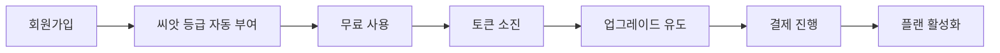

# 💳 결제 시스템 연동 가이드

> **작성일**: 2025년 10월 31일  
> **버전**: 1.0  
> **상태**: 계획 단계

---

## 📋 목차

1. [개요](#개요)
2. [결제 프로세스](#결제-프로세스)
3. [PG사 선택 가이드](#pg사-선택-가이드)
4. [토스페이먼츠 연동](#토스페이먼츠-연동)
5. [구현 로드맵](#구현-로드맵)
6. [보안 고려사항](#보안-고려사항)
7. [테스트 계획](#테스트-계획)

---

## 개요

토큰플로우 시스템의 결제 연동을 위한 전체 가이드입니다. 정기 구독 결제를 지원하며, 토큰 자동 충전 및 업그레이드 결제를 처리합니다.

### 🎯 목표

- **정기 구독 결제**: 매월 자동 결제
- **즉시 결제**: 토큰 긴급 충전, 플랜 업그레이드
- **결제 실패 처리**: 재시도 및 서비스 중지
- **환불 처리**: 부분 환불 지원

---

## 결제 프로세스

### 1️⃣ 신규 가입 프로세스



### 2️⃣ 정기 결제 프로세스

```
1. 구독 시작일 저장
2. 매월 동일 날짜에 자동 결제
3. 결제 성공 → 토큰 갱신
4. 결제 실패 → 3일간 재시도
5. 최종 실패 → 서비스 중지 + 씨앗 등급 전환
```

### 3️⃣ 업그레이드 프로세스

```
1. 현재 플랜 확인
2. 차액 계산 (일할 계산)
3. 즉시 결제
4. 성공 시 토큰 즉시 증가
5. 다음 달부터 새 요금 적용
```

---

## PG사 선택 가이드

### 📊 비교 분석

| PG사 | 정기결제 | 수수료 | API 품질 | 관리자 | 추천도 |
|------|---------|--------|----------|---------|--------|
| **토스페이먼츠** | ✅ 우수 | 2.9% | 매우 좋음 | 편리 | ⭐⭐⭐⭐⭐ |
| **아임포트** | ✅ 좋음 | 3.2% | 좋음 | 보통 | ⭐⭐⭐⭐ |
| **네이버페이** | ⚠️ 제한적 | 2.5% | 보통 | 좋음 | ⭐⭐⭐ |
| **카카오페이** | ⚠️ 제한적 | 3.0% | 보통 | 보통 | ⭐⭐⭐ |

### 🏆 추천: 토스페이먼츠

**장점:**
- 정기결제 빌링키 방식 지원
- 깔끔한 API 문서
- 실시간 웹훅 지원
- 테스트 환경 제공

---

## 토스페이먼츠 연동

### 1️⃣ 환경 변수 설정

```env
# 토스페이먼츠 설정
TOSS_CLIENT_KEY=test_ck_...  # 클라이언트 키
TOSS_SECRET_KEY=test_sk_...  # 시크릿 키
TOSS_WEBHOOK_SECRET=...       # 웹훅 시크릿
```

### 2️⃣ API 구현

#### **결제 요청 API** (`/api/payment/request.js`)

```javascript
const { v4: uuidv4 } = require('uuid');
const axios = require('axios');

async function requestPayment(userId, planId, amount) {
  const orderId = `ORDER_${uuidv4()}`;
  
  // 결제 요청 데이터 생성
  const paymentData = {
    amount,
    orderId,
    orderName: `사장픽 ${planId} 플랜 구독`,
    successUrl: `${process.env.BASE_URL}/payment/success`,
    failUrl: `${process.env.BASE_URL}/payment/fail`,
    customerEmail: user.email,
    customerName: user.name
  };

  // 토스페이먼츠 API 호출
  const response = await axios.post(
    'https://api.tosspayments.com/v1/payments',
    paymentData,
    {
      headers: {
        Authorization: `Basic ${Buffer.from(process.env.TOSS_SECRET_KEY + ':').toString('base64')}`,
        'Content-Type': 'application/json'
      }
    }
  );

  return response.data;
}
```

#### **빌링키 발급** (정기결제용)

```javascript
async function issueBillingKey(userId, customerKey, authKey) {
  const response = await axios.post(
    `https://api.tosspayments.com/v1/billing/authorizations/issue`,
    {
      authKey,
      customerKey
    },
    {
      headers: {
        Authorization: `Basic ${Buffer.from(process.env.TOSS_SECRET_KEY + ':').toString('base64')}`,
        'Content-Type': 'application/json'
      }
    }
  );

  // 빌링키 저장
  await supabase
    .from('user_billing')
    .upsert({
      user_id: userId,
      billing_key: response.data.billingKey,
      card_number: response.data.card.number,
      card_company: response.data.card.company,
      created_at: new Date()
    });

  return response.data;
}
```

#### **자동 결제 실행**

```javascript
async function executeAutoPayment(userId) {
  // 사용자 빌링 정보 조회
  const { data: billing } = await supabase
    .from('user_billing')
    .select('*')
    .eq('user_id', userId)
    .single();

  if (!billing?.billing_key) {
    throw new Error('빌링키가 없습니다');
  }

  // 결제 금액 조회
  const amount = await getSubscriptionAmount(userId);

  // 토스페이먼츠 자동 결제 API
  const response = await axios.post(
    'https://api.tosspayments.com/v1/billing/' + billing.billing_key,
    {
      customerKey: userId,
      amount,
      orderId: `SUB_${Date.now()}`,
      orderName: '사장픽 월간 구독'
    },
    {
      headers: {
        Authorization: `Basic ${Buffer.from(process.env.TOSS_SECRET_KEY + ':').toString('base64')}`,
        'Content-Type': 'application/json'
      }
    }
  );

  // 결제 성공 처리
  if (response.data.status === 'DONE') {
    await handlePaymentSuccess(userId, response.data);
  }

  return response.data;
}
```

### 3️⃣ 웹훅 처리

```javascript
// api/payment/webhook.js
module.exports = async (req, res) => {
  // 서명 검증
  const signature = req.headers['toss-signature'];
  if (!verifyWebhookSignature(req.body, signature)) {
    return res.status(401).json({ error: 'Invalid signature' });
  }

  const { eventType, data } = req.body;

  switch (eventType) {
    case 'PAYMENT.DONE':
      // 결제 완료
      await handlePaymentComplete(data);
      break;
      
    case 'PAYMENT.FAILED':
      // 결제 실패
      await handlePaymentFailed(data);
      break;
      
    case 'PAYMENT.CANCELED':
      // 결제 취소/환불
      await handlePaymentCanceled(data);
      break;
  }

  res.json({ received: true });
};
```

### 4️⃣ 데이터베이스 스키마

```sql
-- 사용자 빌링 정보
CREATE TABLE user_billing (
  id uuid PRIMARY KEY DEFAULT gen_random_uuid(),
  user_id uuid REFERENCES profiles(id),
  billing_key text UNIQUE,
  customer_key text,
  card_number text, -- 마스킹된 카드번호
  card_company text,
  is_active boolean DEFAULT true,
  created_at timestamp DEFAULT now(),
  updated_at timestamp DEFAULT now()
);

-- 결제 내역
CREATE TABLE payment_history (
  id uuid PRIMARY KEY DEFAULT gen_random_uuid(),
  user_id uuid REFERENCES profiles(id),
  order_id text UNIQUE,
  payment_key text,
  amount integer,
  status text, -- 'pending', 'done', 'failed', 'canceled'
  method text, -- 'card', 'transfer', 'phone'
  requested_at timestamp,
  approved_at timestamp,
  failed_at timestamp,
  failure_reason text,
  receipt_url text,
  created_at timestamp DEFAULT now()
);

-- 결제 실패 재시도
CREATE TABLE payment_retry (
  id uuid PRIMARY KEY DEFAULT gen_random_uuid(),
  user_id uuid REFERENCES profiles(id),
  original_payment_id uuid REFERENCES payment_history(id),
  retry_count integer DEFAULT 0,
  max_retries integer DEFAULT 3,
  next_retry_at timestamp,
  status text, -- 'scheduled', 'completed', 'failed'
  created_at timestamp DEFAULT now()
);
```

---

## 구현 로드맵

### Phase 1: 기본 결제 (1주)
- [ ] 토스페이먼츠 계정 생성
- [ ] 결제 요청 API 구현
- [ ] 결제 성공/실패 처리
- [ ] 결제 내역 저장

### Phase 2: 정기 결제 (1주)
- [ ] 빌링키 발급 프로세스
- [ ] 자동 결제 크론 작업
- [ ] 결제 실패 재시도
- [ ] 카드 정보 관리

### Phase 3: 관리 기능 (3일)
- [ ] 환불 처리
- [ ] 결제 내역 조회
- [ ] 영수증 발급
- [ ] 관리자 대시보드

### Phase 4: 고급 기능 (3일)
- [ ] 쿠폰/할인 시스템
- [ ] 다중 결제 수단
- [ ] 해외 결제 지원
- [ ] 부분 환불

---

## 보안 고려사항

### 🔐 필수 보안 조치

1. **PCI DSS 준수**
   - 카드 정보 직접 저장 금지
   - 빌링키만 저장

2. **웹훅 서명 검증**
   ```javascript
   function verifyWebhookSignature(body, signature) {
     const hash = crypto
       .createHmac('sha256', process.env.TOSS_WEBHOOK_SECRET)
       .update(JSON.stringify(body))
       .digest('base64');
     return hash === signature;
   }
   ```

3. **API 키 보안**
   - 환경 변수 사용
   - 서버 사이드에서만 처리
   - 키 정기 교체

4. **결제 정보 암호화**
   - 민감 정보 암호화 저장
   - HTTPS 필수
   - Rate Limiting 적용

---

## 테스트 계획

### 1️⃣ 단위 테스트

```javascript
// __tests__/payment.test.js
describe('결제 시스템', () => {
  test('결제 요청 생성', async () => {
    const payment = await requestPayment(userId, 'power', 30000);
    expect(payment.orderId).toBeDefined();
    expect(payment.amount).toBe(30000);
  });

  test('빌링키 발급', async () => {
    const billing = await issueBillingKey(userId, customerKey, authKey);
    expect(billing.billingKey).toBeDefined();
  });

  test('웹훅 서명 검증', () => {
    const isValid = verifyWebhookSignature(body, signature);
    expect(isValid).toBe(true);
  });
});
```

### 2️⃣ 통합 테스트 시나리오

1. **정상 결제 플로우**
   - 결제 요청 → 카드 입력 → 결제 완료 → 토큰 충전

2. **결제 실패 처리**
   - 잔액 부족 → 재시도 → 최종 실패 → 서비스 중지

3. **업그레이드 시나리오**
   - 씨앗 → 파워 → 차액 계산 → 결제 → 즉시 적용

4. **환불 처리**
   - 환불 요청 → 검토 → 승인 → 부분 환불 → 토큰 차감

### 3️⃣ 테스트 카드

```
# 토스페이먼츠 테스트 카드
- 성공: 4242-4242-4242-4242
- 잔액부족: 4000-0000-0000-0002
- 정지카드: 4000-0000-0000-0006
```

---

## 예상 비용

### 월간 예상 비용 (100명 기준)

| 항목 | 금액 | 설명 |
|------|------|------|
| PG 수수료 | 87,000원 | 3,000,000원 × 2.9% |
| 부가세 | 8,700원 | 수수료의 10% |
| SMS 알림 | 5,000원 | 50원 × 100건 |
| **총 비용** | **100,700원** | 월 매출의 약 3.3% |

---

## 🚀 다음 단계

1. **토스페이먼츠 가입**
   - https://developers.tosspayments.com
   - 사업자 등록증 준비
   - API 키 발급

2. **개발 환경 구축**
   ```bash
   pnpm add axios uuid crypto
   ```

3. **테스트 진행**
   - 테스트 모드에서 전체 플로우 검증
   - 실제 카드로 소액 테스트

4. **프로덕션 전환**
   - 실제 API 키로 교체
   - 모니터링 설정
   - 고객 지원 준비

---

## 📞 지원

**토스페이먼츠 지원:**
- 기술 문의: https://discord.gg/tosspayments
- 이메일: support@tosspayments.com
- 문서: https://docs.tosspayments.com

**프로젝트 문의:**
- 이메일: admin@bosikpick.com
- 문서: `/docs/PAYMENT_INTEGRATION_GUIDE.md`

---

**마지막 업데이트**: 2025년 10월 31일 ✅
